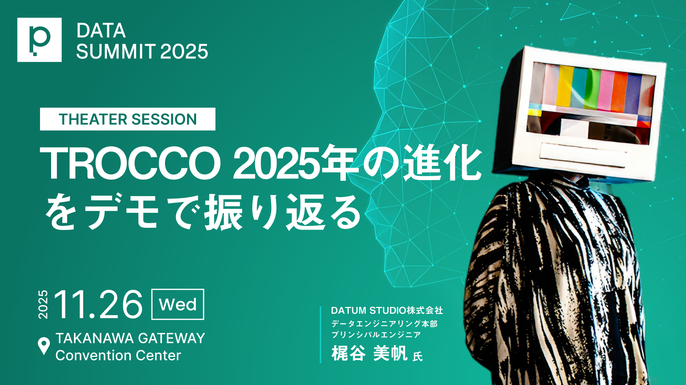

# [primeNumber DATA SUMMIT シアターセッション「TROCCO 2025年の進化をデモで振り返る」](https://primenumber.com/data-summit/2025?session=TS-1)



デモのソースコードです。

## フォルダ構成

| パス | 説明 |
|------|------|
| images | バナー画像 |
| terraform | Terraformソースコード |

### Terraform フォルダ

```
terraform/
├── dockerfiles/
│   └── tf.Dockerfile
├── compose.yaml
├── Makefile
├── ほげほげ.tf
└── .terraform.lock.hcl  # 自動生成
```

使い方:

```bash-session
cd terraform
make run      # コンテナに入る # ここで init、play、apply などする
```

## 発表資料

[TROCCO 2025年の進化をデモで振り返る - Speaker Deck](https://speakerdeck.com/__allllllllez__/trocco-2025nian-nojin-hua-wodemodezhen-rifan-ru)

## デモ解説記事
[TROCCO 2025年の進化をデモで振り返った話](https://zenn.dev/datum_studio/articles/df8c64ca0dccfd)
